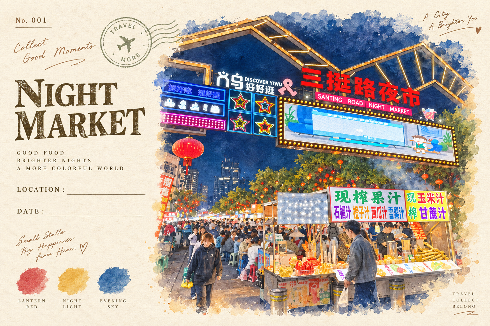
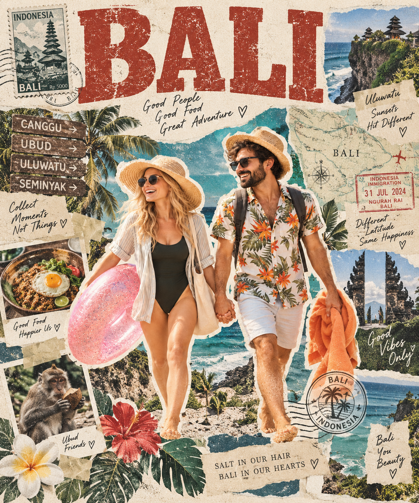
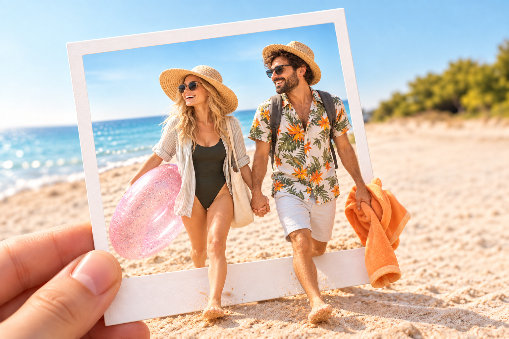
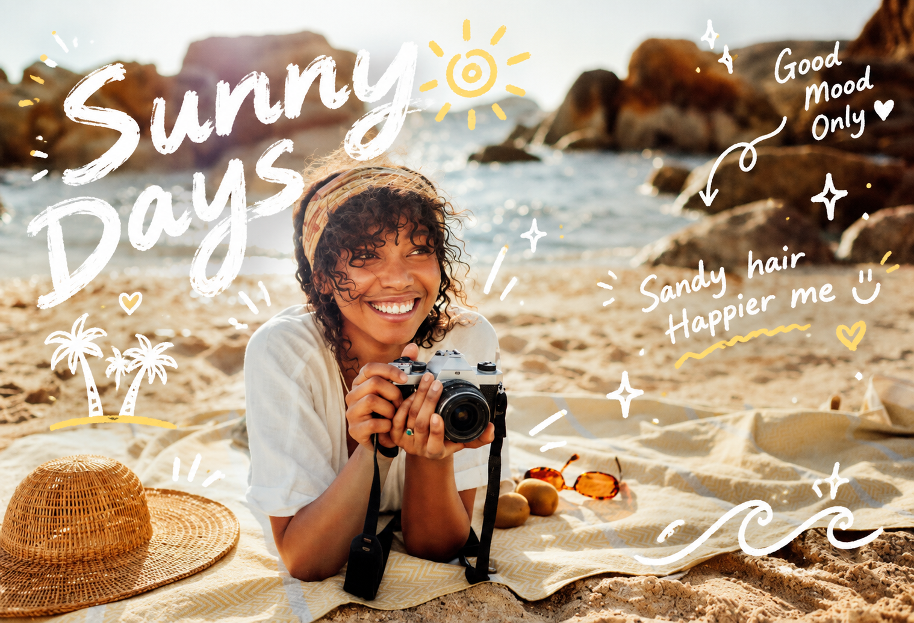
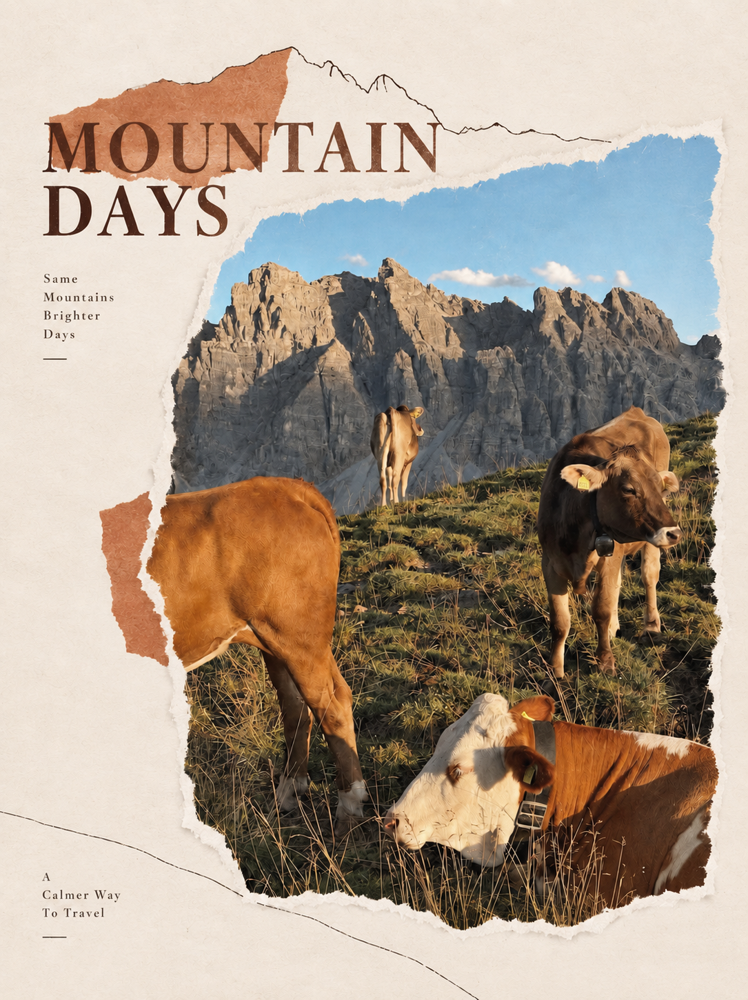
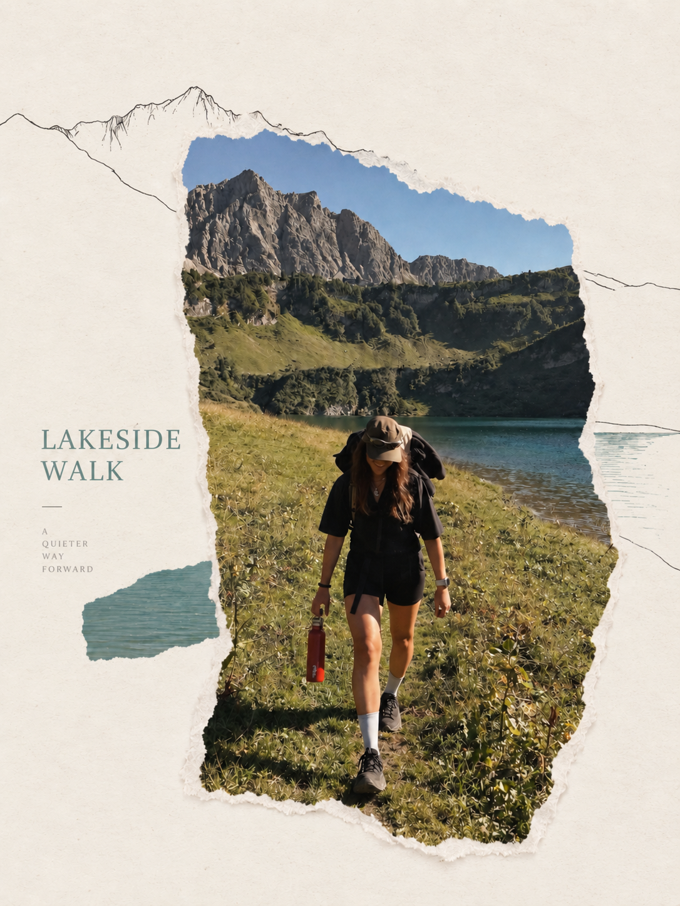
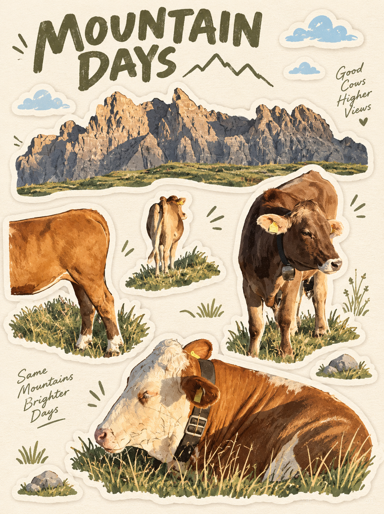
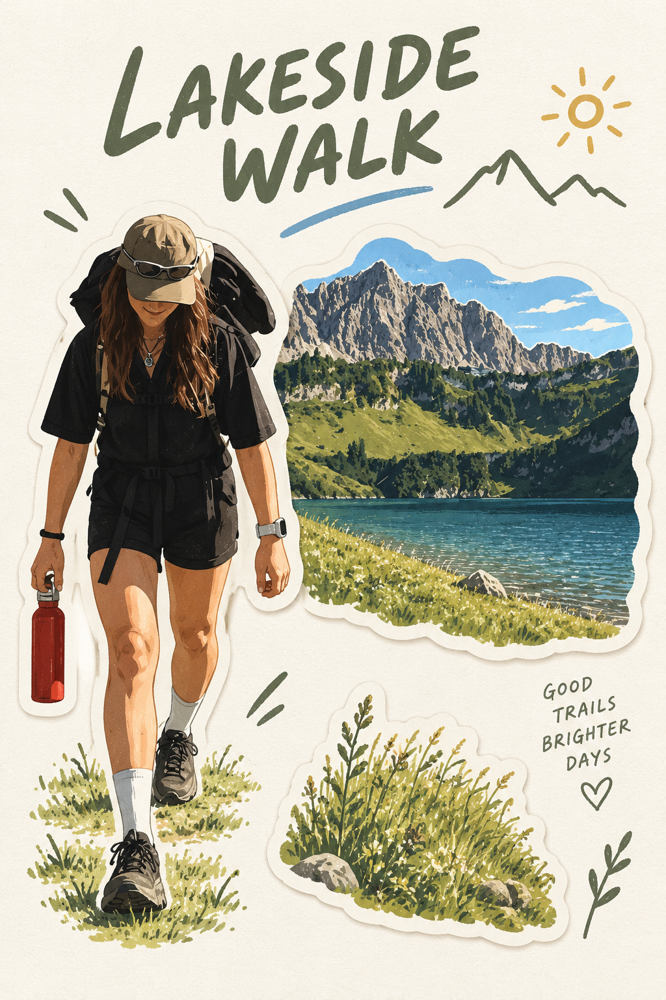

# 假期照片 Skill · kairo-holiday-image

把随手拍的旅行、度假与生活照片，处理成值得分享和收藏的照片与设计作品。

先处理曝光、偏色、噪点、反光等可观察问题，再选择适合照片的视觉表达。
不用在长长的风格列表中反复挑选：你可以指定风格，也可以让 Agent
根据照片内容自动选择。基础修图与风格分开，多个方向分别输出。

**个人非商业使用免费，商业使用需事先获得书面授权。**

## 效果示例

以下是实际生成的风格成片，展示照片的多种表达方式；不展示原始素人照片。

| 夜市 · 旅行记忆卡 | 巴厘岛 · 旅行拼贴海报 |
| --- | --- |
|  |  |

| 海边 · 拍立得出框效果 | 海边 · ins 手绘注释 |
| --- | --- |
|  |  |

### 山间假日 · 撕纸几何拼贴

| 山间牛群 | 湖边徒步 |
| --- | --- |
|  |  |

### 山间假日 · 旅行贴纸卡

| 山间牛群 | 湖边徒步 |
| --- | --- |
|  |  |

以上案例用于展示风格效果，不是基础修复的前后对比。结果由图像模型生成，
可能存在细节变化，不代表像素级保真或所有照片都能获得同样效果。

## 基础修图能力

基础修图不是风格选项。可以单独使用，也可以在风格创作前按照片问题启用，
不要求用户逐项选择，更不会把所有修复强行套到每张照片上。

| 能力 | 处理内容 |
| --- | --- |
| 人物自然美化 | 改善临时皮肤瑕疵、碎发与衣物小问题，调整面部光影和肤色，保留肤质、年龄与身份特征，不默认换脸或重塑五官 |
| 过曝与高光修复 | 压低刺眼高光，改善曝光层次；只恢复仍有信息的区域，完全丢失的细节不承诺真实还原 |
| 暗光与逆光修复 | 提亮过暗人物和阴影，平衡主体与背景亮度，保留夜景、逆光及原有光线氛围 |
| 偏色与自然增强 | 调整白平衡、肤色、对比度和饱和度，改善发灰、偏黄或偏绿，不默认高饱和滤镜 |
| 噪点与轻度模糊处理 | 减轻低光噪点、压缩痕迹和轻微失焦，保留合理纹理，不凭空补造无法辨认的五官或文字 |
| 反光与雾感清理 | 减轻玻璃反光、眩光、污点与灰雾对主体的遮挡，无法辨认的遮挡区域不保证恢复 |
| 建筑透视与画面整理 | 按需改善建筑倾斜与透视，减少小范围干扰；裁切、扩图与内容替换先确认 |
| 合照局部表情修复 | 用户明确提出且有对应人物参考时，尝试局部修复，不凭空生成另一张脸 |

人物比例优先保留自然状态；需要改变身材比例时先确认，不默认拉腿、放大头部或套用固定比例。
换天空、换背景、天气和时段转换也先征询意见，并使光位、阴影及色温协调。

## 风格出片

| 方向 | 可用风格 |
| --- | --- |
| 摄影质感 | 旅行胶片、阳光生命感人像 |
| 照片装饰与编辑 | ins 风画面注释、指定物体文字涂鸦、旅行杂志页、撕纸几何海报 |
| 旅行收藏 | 景点明信片、核心建筑旅行贴纸、旅行贴纸卡、旅行记忆插画卡、照片与抽象记忆、旅行印章档案 |
| 主题创作 | 人物旅行海报、拍立得 3D 公仔打卡、旅游碎片行李箱、演唱会氛围、美食炸弹、宠物公路电影角色替换 |

先按需修复曝光、白平衡、低光、噪点、反光、轻度模糊与建筑透视。
合照局部表情修复需要明确要求和对应人物参考，不凭空造五官。
部分主题创作有额外输入要求，详见 [风格目录](references/playbook.md)。

## 安装

```bash
npx -y skills add byKairo/kairo-holiday-image -g --all
```

## 使用

上传照片后输入：

> 使用 $kairo-holiday-image，先完成必要修复，再自动选择适合的风格，逐张出片。

也可以指定“旅行贴纸卡”或只要求基础修复。多个风格分别交付，不默认拼图。

```text
使用 $kairo-holiday-image，把这张照片做成旅行贴纸卡。
```

```text
使用 $kairo-holiday-image，只修复这张夜景的噪点和偏色，不换风格。
```

```text
使用 $kairo-holiday-image，分别给我旅行胶片和 ins 手绘注释两张成片。
```

## 环境与边界

需要可读取照片、支持参考图编辑的图像生成工具；Skill 本身不包含图像模型，
也不安装额外修图软件。图像服务的费用和条款以所用平台为准。

换天空、换背景及天气转换先征询用户；保留人物身份与年龄相符的身体比例。
人物保真以实际结果核对为准，不承诺像素级不变。无法恢复的五官或文字不虚构。
默认输出静态图片，不支持 Live Photo。

## 许可

个人非商业使用免费；商业使用须事先获得书面授权。详见 [LICENSE](LICENSE)。
这是源码公开的非商业许可，不是 MIT 或 Apache 开源许可。
商业授权可通过本仓库 Issues 联系维护者。

## 案例图片与权益联系

案例图片仅用于展示本 Skill 的处理效果，不随 Skill 许可授予素材、肖像、
商标或其他第三方内容的使用权，请勿据此直接转载或商用案例图。

如案例涉及您的著作权、肖像权或其他合法权益，请通过
[GitHub Issues](https://github.com/byKairo/kairo-holiday-image/issues) 联系维护者，
提供对应图片链接及必要说明。收到有效反馈后，我们将及时核实并下架
或调整相关内容。联系下架说明不替代素材授权。

## 验证情况

结构校验通过。旅行贴纸卡已完成真实照片试用并得到用户认可；
其他风格尚未全部完成独立回归测试。
